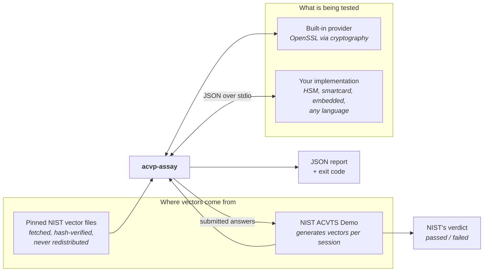
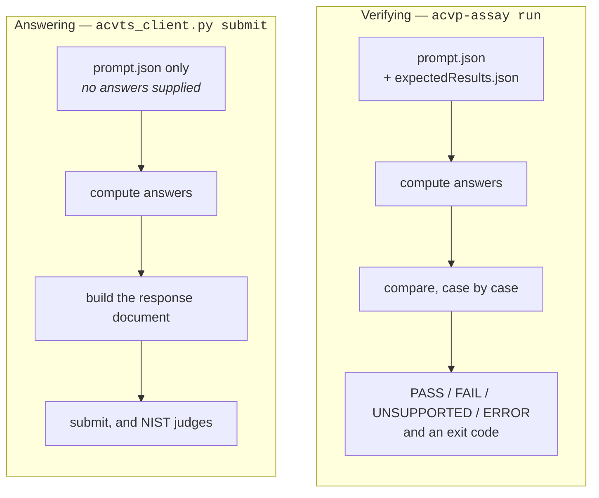
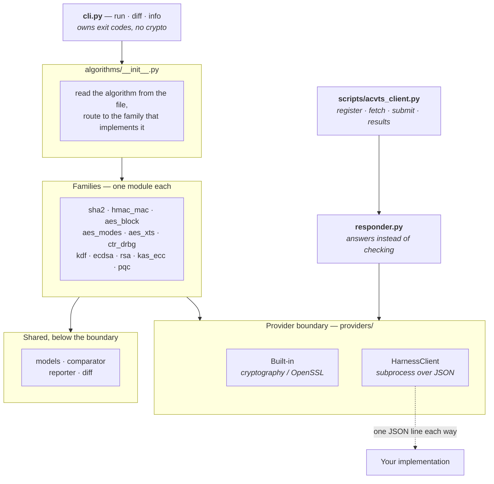
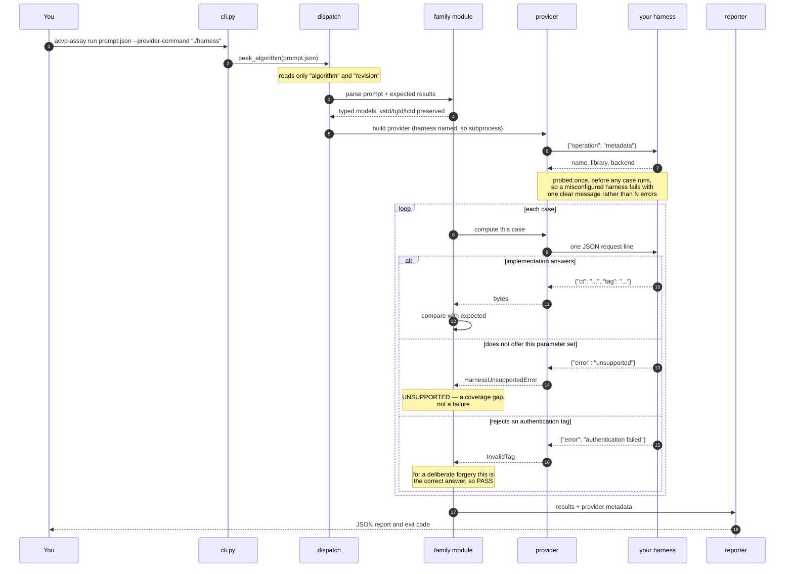
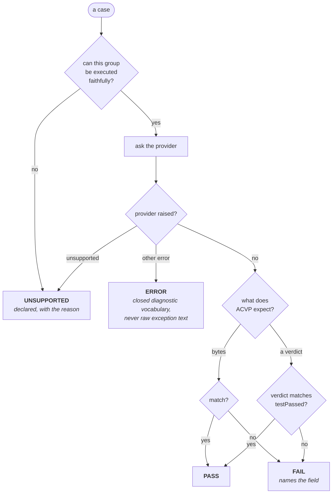
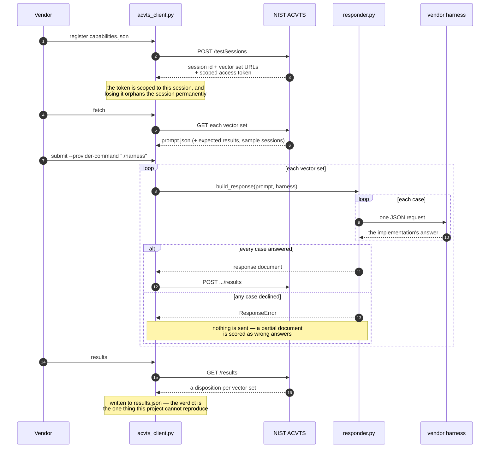
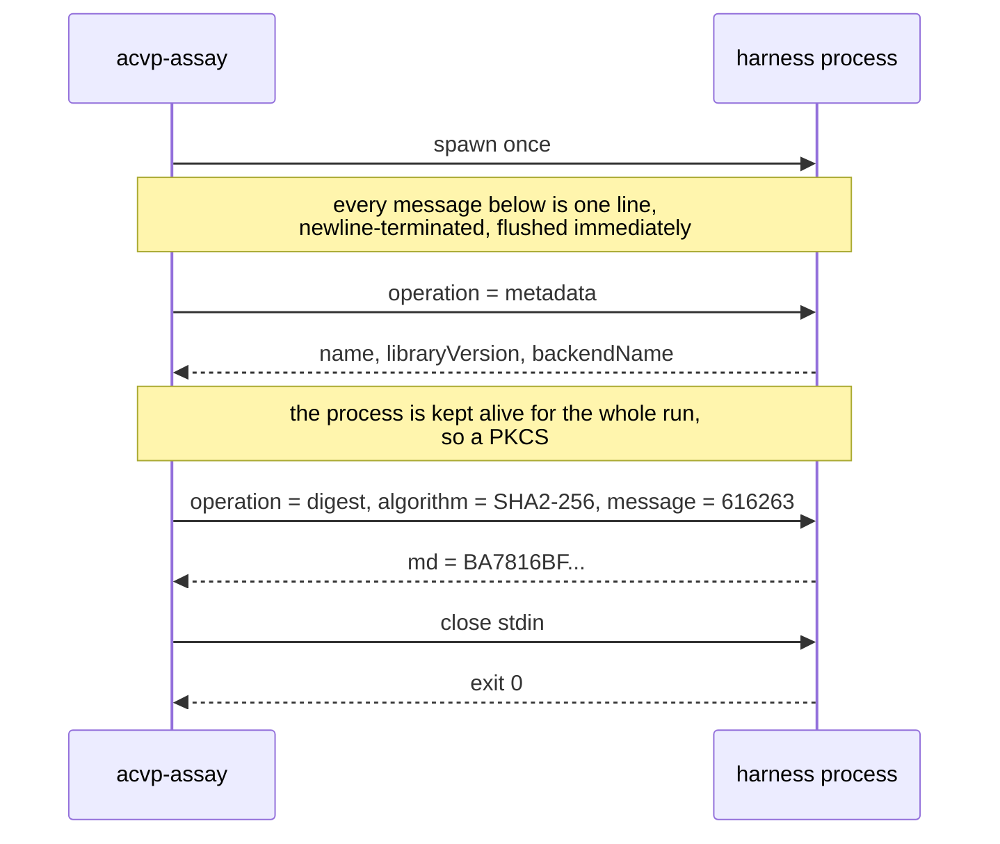
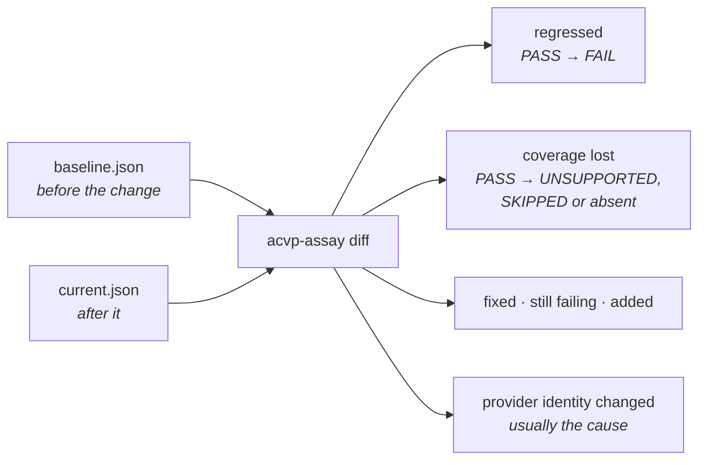
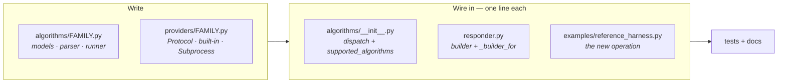

# Design: high and low level

Diagrams are Mermaid, which GitHub renders inline. They are text, so they diff
and review like code and cannot drift out of date silently the way an exported
image does.

`architecture.md` states the boundaries and the rules. This file shows the
shapes.

---

# High-level design

## What the system is for

ACVP is NIST's protocol for validating cryptographic *algorithms*. A vendor's
module has to prove it computes AES, SHA-2, RSA and the rest exactly as the
standards define, and a laboratory eventually runs that testing for a
certificate. This project runs the same vectors earlier, against
implementations a laboratory's tooling often cannot reach, and reports what
would fail before the billable hours start.



The two things that distinguish this from `libacvp` and ACVP Proxy are both
visible above: **nothing is linked against the implementation**, and the same
runner can answer a live session rather than only checking files.

## The two paths

Everything below the provider boundary is shared. Above it, there are two
different jobs, and they differ in what they are given and what they produce.



The asymmetry matters and shapes the code:

|  | Verifying | Answering |
| --- | --- | --- |
| Has the expected results | yes | no |
| A case it cannot answer | reported UNSUPPORTED, run continues | **refuses the whole document** |
| Who decides correctness | this runner | NIST's server |

A missing case in a submission is scored as a *wrong answer*, not as an
incomplete run. That single fact is why `responder.py` refuses rather than
half-answers, and it is the sharpest difference between the two paths.

## Layers



Each family owns its own models, parser and runner because the group shapes
have little in common — AES-GCM has directions and authentication failures,
SHA-2 has chained Monte Carlo groups, the DRBGs have a state machine per case.
What they share is everything *downstream* of execution: the result vocabulary,
the comparator, the reporter and the exit-code rules.

Adding a family means writing one module and adding one line to the dispatcher.

---

# Low-level design

## Verifying one vector file



## How a case is classified

Getting this wrong in either direction is the worst output the tool can
produce: telling a vendor their module is broken when it merely lacks a curve,
or reporting a real defect as a coverage gap.



`--strict` makes UNSUPPORTED and SKIPPED count against the exit code, so a
coverage gap cannot pass quietly in CI.

## Answering a live session

This is the flow a vendor runs against their own implementation.



## The harness contract

The entire protocol: one JSON request per line in, one JSON response per line
out, until stdin closes.



On the wire that is:

```text
→ {"operation": "digest", "algorithm": "SHA2-256", "message": "616263"}
← {"md": "BA7816BF8F01CFEA414140DE5DAE2223B00361A396177A9CB410FF61F20015AD"}
```

Three rules a harness must follow, each learned from a way this goes wrong:

- **Flush after every line.** A buffered harness is indistinguishable from a
  hung one.
- **`{"error": "unsupported"}` for a parameter set you do not offer.** It is
  reported UNSUPPORTED, not as a failure. Capability belongs to the
  implementation.
- **`{"error": "authentication failed"}` for a rejected tag** — never a crash
  or a non-zero exit. Roughly a third of NIST's AES-GCM decrypt cases are
  deliberate forgeries where rejecting is correct, and a harness that dies on
  them scores a conforming module as broken.

A harness that reads stdin to end and exits also works; the transport detects
that on the first exchange, because a shell script with `jq` naturally takes
that shape.

## Catching regressions between runs



**Coverage loss counts as a regression.** A case that used to run and now does
not is reported as loudly as an outright failure, because that is the failure
mode that hides: the totals still look clean once the case stops being counted.

## Adding a family



The order that has worked every time here: **register a sample session on
ACVTS, fetch real vectors, and confirm the algorithm against NIST's own
expected results before writing any module code.** Three of the four defects
this project has found came from doing that; the specification's prose has more
than once been insufficient on its own.
